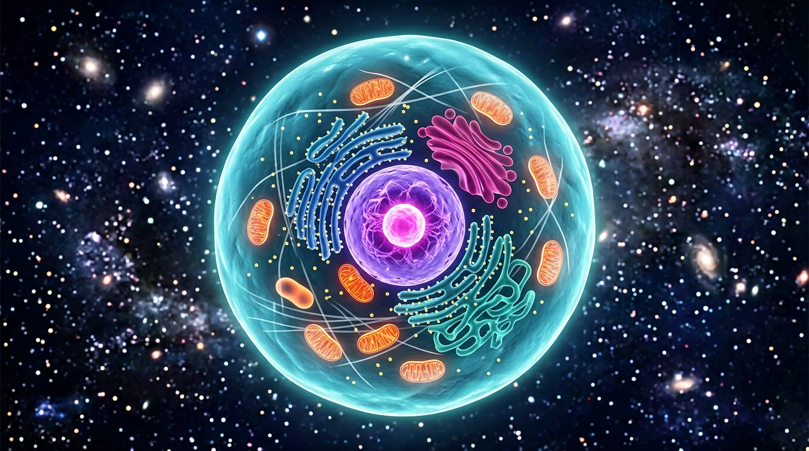

# 🧫 VR Human Cell

An interactive **3D / WebXR explorer** of a human (eukaryotic) cell that runs
entirely in the browser — no build step, no install, works on desktop, mobile,
and VR headsets.



---

## ✨ Features

- **Fully interactive 3D cell** — orbit, zoom and dive inside a living cell with
  13 explorable structures: cell membrane, nucleus, nucleolus, mitochondria,
  rough & smooth ER, Golgi apparatus, ribosomes, lysosomes, peroxisomes,
  centrosome & centrioles, cytoskeleton and transport vesicles.
- **Click-to-learn** — every organelle is clickable and opens a panel with a
  plain-English explanation and a fun fact.
- **🥽 WebXR VR mode** — on a VR-capable browser an *Enter VR* button appears;
  point at organelles with your controller to learn about them in-world.
- **▶ Guided tour** — an automated fly-through that visits every organelle.
- **✂️ Cutaway view** — animated cross-section slice for textbook-style viewing.
- **🏷 Floating labels** — toggleable 3D labels anchored to each organelle.
- **Living details** — drifting transport vesicles, pulsing mitochondria,
  shimmering ribosomes and a gently breathing membrane.
- **Zero dependencies at runtime** — Three.js is vendored in the repo; the app
  is pure static files and works offline once loaded.

## 🚀 Quick start

Any static file server works. Two easy options:

```bash
# Option A — Node.js (zero-dependency server included)
node server.js          # or: npm start

# Option B — Python
python3 -m http.server 3000
```

Then open **http://localhost:3000** in a browser.

> ⚠️ Opening `index.html` directly from the file system (`file://`) will **not**
> work — browsers block ES-module imports there. Use any local server instead.

## 🥽 Using VR mode

WebXR requires a **secure context** (HTTPS or `localhost`):

1. Serve the app over HTTPS — e.g. deploy to GitHub Pages (see below), or use a
   tunnel such as `ngrok http 3000` / `cloudflared` for local testing.
2. Open the HTTPS URL in a VR browser (Meta Browser, Wolvic, …).
3. Click **Enter VR**, then point at organelles and pull the trigger to select
   them. Descriptions appear on a floating panel in the headset (and in the
   browser mirror window).

## 🎮 Controls

| Input | Action |
| --- | --- |
| Drag / one finger | Orbit around the cell |
| Scroll wheel / pinch | Zoom (you can fly inside the cell) |
| Right-drag / two fingers | Pan |
| Click / tap an organelle | Select it and show its info |
| Click a name in the left list | Fly the camera to that organelle |
| `Esc` | Close info / stop tour |
| VR controller trigger | Select the organelle you point at |

## 🗂 Project structure

```
├── index.html                  # App shell, import map, HUD
├── css/style.css               # UI theme (glassmorphism HUD)
├── js/
│   ├── main.js                 # Bootstrap: scene, lights, loop, VR glue
│   ├── cell.js                 # Procedural 3D model of every organelle
│   ├── data.js                 # Educational content per organelle
│   ├── labels.js               # Floating 3D name labels
│   ├── interactions.js         # Mouse/touch + VR-controller picking
│   ├── tour.js                 # Guided-tour state machine
│   └── ui.js                   # Info panel, legend, control bar
├── vendor/three/               # Three.js r186 (MIT), vendored — no CDN needed
├── assets/hero.jpg             # README hero image
├── server.js                   # Tiny zero-dependency static server (Node ≥18)
└── package.json
```

## 🛠 Tech notes

- **[Three.js](https://threejs.org)** r186, loaded as native ES modules via an
  import map — no bundler, transpiler or `npm install` needed.
- Everything (geometry, textures, labels) is **generated procedurally** in code;
  there are no model files to download.
- Cutaway mode uses Three.js clipping planes; selection uses ray-casting with a
  priority system so nested organelles (like the nucleolus inside the nucleus)
  can be picked precisely.
- The cell model is stylized: organelle sizes, counts and positions are
  simplified for clarity — it is a learning aid, not a histological reference.

## ☁️ Deployment (GitHub Pages)

The app is 100 % static, so it can be hosted for free:

```bash
# Using GitHub CLI
gh repo edit --enable-pages --pages-branch main --pages-path /
```

…or simply: **Settings → Pages → Source: `main` branch / root**.

## 📄 License

- Application code: **MIT** — see `package.json`.
- Three.js (`vendor/three/`): MIT © Three.js authors — see
  `vendor/three/LICENSE.three.txt`.

## 🧭 Roadmap ideas

- [ ] Fact-quiz mode ("find the mitochondrion!")
- [ ] Plant-cell variant (cell wall, chloroplasts, large vacuole)
- [ ] Hand-tracking support for WebXR
- [ ] Localization (i18n) of organelle descriptions
